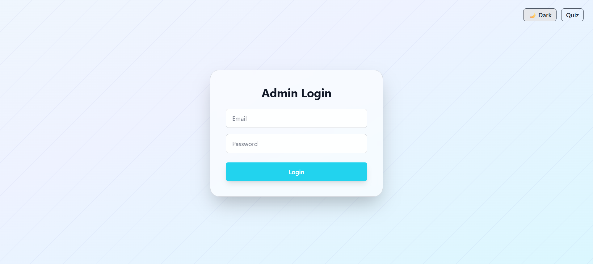

# 🧑‍💻 Quiz Application

This project is a **full-stack Quiz Application** built with:

* **Frontend**: React + TypeScript + TailwindCSS
* **Backend**: Node.js + Express
* **Database**: PostgreSQL

It allows users to take quizzes, stores their attempts, and provides an **Admin Dashboard** for monitoring results.

---

## 🚀 Features

* User quiz flow (start, answer, submit).
* Prevents duplicate submissions per user.
* Tracks detailed answers, score and time per question.
* Admin login with JWT authentication.
* Admin dashboard to view all attempts & details.

---

## 🔄 Flow of the Application

1. **Start Quiz**

   * User registers with **name** & **email** → [`POST /quiz/start`](#post-quizstart).
   * Backend checks if the user already exists in the `users` table.

     * ✅ **First attempt** → creates a new user and returns quiz questions.
     * 🔁 **Already attempted** → returns the previous score instead of starting again.

2. **Taking the Quiz**

   * User answers questions on the frontend.
   * Each answer is tracked along with the **time spent per question**.

3. **Submit Quiz**

   * User submits answers → [`POST /quiz/submit`](#post-quizsubmit).
   * Backend:

     * Compares submitted answers against `correct_index`.
     * Calculates **score**.
     * Stores results into:

       * `attempts` table → overall quiz result.
       * `answers` table → per-question details (answer, correctness, time).

4. **Admin Registration (Secure)**

   * Admin registers → [`POST /admin/signup`](#post-adminsignup).
   * Requires:

     * `x-admin-secret` header with the **master key** (from environment variable `ADMIN_MASTER_KEY`).
     * `email` and `password`.
   * ✅ Only requests with the **valid master key** can create new admins.

5. **Admin Login**

   * Admin logs in with credentials → [`POST /admin/login`](#post-adminlogin).
   * Uses the `admins` table for authentication.
   * Returns a **JWT token** for accessing protected admin routes.

6. **Admin Dashboard**

   * Admin fetches quiz attempts → [`GET /admin/attempts`](#get-adminattempts).
   * Displays:

     * User info (`name`, `email`)
     * Quiz results (`score`, `total`)
     * Attempt metadata (`startedAt`, `submittedAt`)
     * Detailed answers per question.


---

## 📸 Application Screenshots

### User Interface

#### Quiz Login - Light Mode


#### Quiz Login - Dark Mode


#### Quiz Interface - Light Mode


#### Quiz Interface - Dark Mode


#### Result Page - Light Mode


#### Result Page - Dark Mode


### Admin Interface

#### Admin Login - Light Mode


#### Admin Login - Dark Mode


#### Admin Dashboard - Light Mode


#### Admin Dashboard - Dark Mode


#### User Summary - Light Mode


#### User Summary - Dark Mode


### Additional Features

#### Attempt Prevention Popup

*Shown when a user tries to take the quiz again*

---

## 🖥️ Frontend

* Built using **React + Vite + TypeScript**.
* TailwindCSS for styling.
* Pages:

  * **Start Page** → User enters name & email.
  * **Quiz Page** → Fetches questions and allows answering.
  * **Result Page** → Displays result after submission.
  * **Admin Dashboard** → Displays user attempts in a table; expandable for detailed view.

## ⚙️ Backend (API)

### Quiz APIs (`quiz.ts`)

| Endpoint           | Method | Description                                                      |
| ------------------ | ------ | ---------------------------------------------------------------- |
| `/api/quiz/start`  | POST   | Start quiz by verifying if user exists. Creates new user if not. |
| `/api/quiz`        | GET    | Fetch all quiz questions (public: text + options).               |
| `/api/quiz/submit` | POST   | Submit quiz answers, calculate score, store attempt + answers.   |

### Admin APIs (`admin.ts`)

| Endpoint              | Method | Description                                                       |
| --------------------- | ------ | ----------------------------------------------------------------- |
| `/api/admin/signup`   | POST   | Create a new admin account (requires master key).                 |
| `/api/admin/login`    | POST   | Admin login, returns JWT token.                                   |
| `/api/admin/attempts` | GET    | Fetch all quiz attempts with user info + answers (JWT protected). |

---

## 🗄️ Database (PostgreSQL Schema)

### 📌 Users Table (`users`)

| Column               | Type                    | Description                                |
| -------------------- | ------------------------| ------------------------------------------ |
| `id`                 | SERIAL PK               | Unique user ID                             |
| `name`               | TEXT                    | User's full name                           |
| `email`              | TEXT UNIQUE             | User's email (must be unique)              |
| `score`              | INT                     | Latest quiz score                          |
| `total`              | INT                     | Total possible score in latest quiz        |
| `details`            | JSONB                   | Latest attempt details (per-question info) |
| `time_taken_seconds` | INT                     | Time taken in seconds to complete quiz     |
| `created_at`         | TIMESTAMP DEFAULT NOW() | When the user was created                  |

### 📌 Questions Table (`questions`)

| Column          | Type      | Description             |
| --------------- | --------- | ----------------------- |
| `id`            | SERIAL PK | Unique question ID      |
| `text`          | TEXT      | Question text           |
| `options`       | TEXT[]    | Multiple choice options |
| `correct_index` | INT       | Index of correct option |


### 📌 Answers Table (`answers`)

| Column               | Type                  | Description                 |
| -------------------- | --------------------- | --------------------------- |
| `id`                 | SERIAL PK             | Unique answer ID            |
| `user_id`            | INT FK → users.id     | Related user                |
| `question_id`        | INT FK → questions.id | Question answered           |
| `selected_index`     | INT                   | Option chosen by user       |
| `correct`            | BOOLEAN               | Whether answer was correct  |


### 📌 Admins Table (`admins`)

| Column               | Type                    | Description                |
| ---------------------| ------------------------| ---------------------------|
| `id`                 | SERIAL PK               | Admin ID                   |
| `email`              | TEXT UNIQUE             | Admin email                |
| `password_hash`      | TEXT                    | Hashed password            |
| `created_at`         | TIMESTAMP DEFAULT NOW() | When the admin was created |


✅ This schema supports:

* **Multiple users** taking the quiz.
* **Multiple attempts per user** (via `attempts` + `answers`).
* **Detailed tracking** of answers + time spent.
* **Admins** who can log in and view results securely.

---

## 🔧 Setup Instructions

### Backend

1. Clone repo & install dependencies

   ```bash
   cd backend
   npm install
   ```
2. Set up PostgreSQL database. 
* Make sure PostgreSQL is installed and running.
* Create the database (replace postgres with your DB username if needed):

   ```
   createdb -U postgres quizdb
   ```
* Run the schema SQL script to create all tables:
   ```
   psql -U postgres -d quizdb -f database/schema.sql
   ```


3. Create a `.env` file:
* Replace user and password with your PostgreSQL username and password:

   ```
   DATABASE_URL=postgresql://<your-username>:<your-password>@localhost:5432/quizdb
   JWT_SECRET=supersecret
   ADMIN_MASTER_KEY=masterkey123
   ```
4. Run backend:

   ```bash
   npm run dev
   ```

### Frontend

1. Go to frontend folder:

   ```bash
   cd frontend
   npm install
   npm run dev
   ```
2. Access app at `http://localhost:5173`.

---

## 🔄 Flow Summary

| Step                   | Description                                                                      |
| ---------------------- | -------------------------------------------------------------------------------- |
| **User Registration**  | User registers with name & email (`/quiz/start`). Backend checks if user exists. |
| **First Attempt**      | Creates user and returns quiz questions.                                         |
| **Already Attempted**  | Returns previous score.                                                          |
| **Answer Questions**   | Tracks answers & time per question on frontend.                                  |
| **Submit Quiz**        | `/quiz/submit` calculates score, stores results in `attempts` + `answers`.       |
| **Admin Registration** | Only with `x-admin-secret` master key (`/admin/signup`).                         |
| **Admin Login**        | `/admin/login` → returns JWT token.                                              |
| **Admin Dashboard**    | `/admin/attempts` → view all attempts with detailed answers.                     |